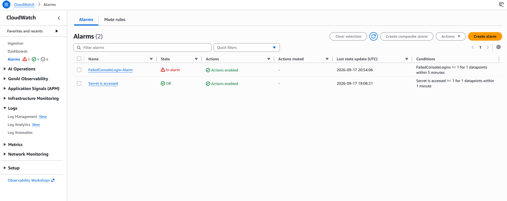
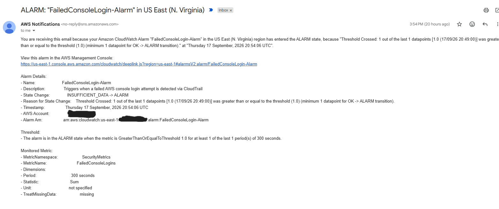
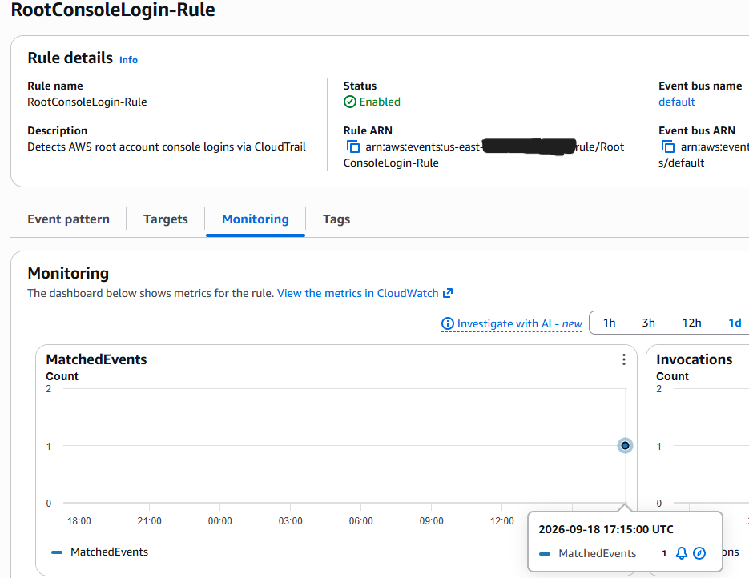
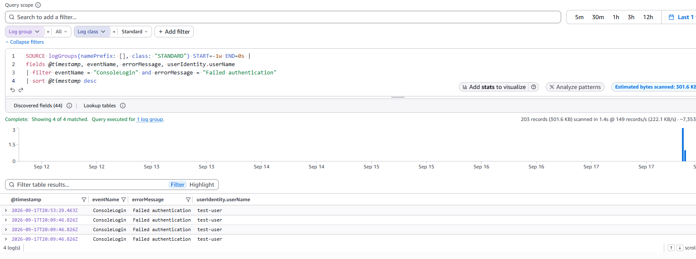
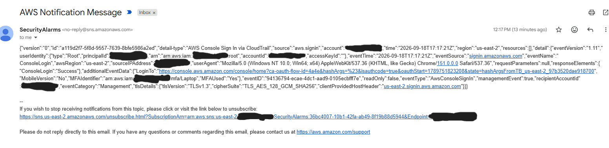
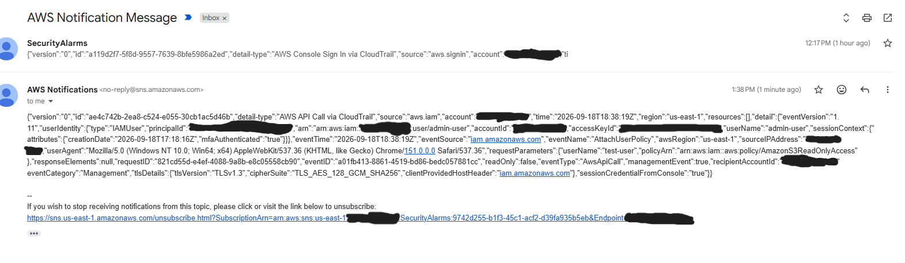

# AWS Security Monitoring Pipeline — CloudTrail, CloudWatch, EventBridge & SNS

## Objective

Built and extended a centralized security monitoring and alerting pipeline on AWS, starting from the NextWork Secrets Manager monitoring lab as a base. The goal was to move beyond the original single-use-case lab and build a more realistic, multi-signal detection pipeline covering several common security events, then verify the entire pipeline end-to-end with real triggered events rather than synthetic tests alone.

## Architecture

```
CloudTrail (management events)
   |
   |-- CloudWatch Logs --> Metric Filter --> CloudWatch Alarm --> SNS --> Email
   |        (failed console login detection)
   |
   |-- EventBridge --> Rule (event pattern match) --> SNS --> Email
            (root console login detection)
            (IAM policy change detection)
```

All alerts route to a single SNS topic (`SecurityAlarms`) to centralize notifications, consistent with the base lab's original Secrets Manager alerting design.

## What I Built (Beyond the Base Lab)

The original NextWork lab covered one detection use case: alerting on Secrets Manager secret access via CloudTrail, CloudWatch, and SNS. I extended this into a broader, multi-signal security monitoring setup:

### 1. Failed Console Login Detection (CloudWatch Metric Filter + Alarm)

- **Metric filter** on the CloudTrail log group, using the pattern:
  ```
  { ($.eventName = "ConsoleLogin") && ($.errorMessage = "Failed authentication") }
  ```
- **Alarm** (`FailedConsoleLogin-Alarm`) triggers when `FailedConsoleLogins >= 1` within a 5-minute window, notifying the `SecurityAlarms` SNS topic.





- **Why this matters:** repeated failed console logins are a classic signal for brute-force or credential-stuffing attempts. This complements the CloudWatch metric-filter pattern from the base lab, applied to a genuinely different and common security use case.

### 2. Root Console Login Detection (EventBridge Rule)

- **EventBridge rule** (`RootConsoleLogin-Rule`) matching CloudTrail console sign-in events specifically where `userIdentity.type = "Root"`, routed to the `SecurityAlarms` SNS topic.
- **Built in two regions (`us-east-1` and `us-east-2`).** During testing, I discovered that CloudTrail can record a root `ConsoleLogin` event under a different `awsRegion` than what the console UI displayed at the time of login — the two were inconsistent across multiple test attempts from the same account and IP. Rather than assume a single region was reliable, I diagnosed this using CloudWatch Logs Insights (comparing timestamps, regions, and source IPs across several login attempts) and built the rule redundantly in both regions to ensure detection regardless of which region CloudTrail ultimately logs the event under.



- **Why this matters:** any root account login is high-signal in a well-run AWS environment, since daily operations should be handled by IAM users/roles, not root. Detecting root usage in near-real-time is a standard security monitoring practice.

### 3. IAM Policy Change Detection (EventBridge Rule)

- **EventBridge rule** (`IAMPolicyChange-Rule`) matching IAM policy-modification events (`PutUserPolicy`, `AttachUserPolicy`, `CreatePolicyVersion`, `AttachRolePolicy`), routed to the `SecurityAlarms` SNS topic.
- **Built specifically in `us-east-1`.** IAM is a global AWS service, and IAM API calls are always recorded by CloudTrail with `us-east-1` as the `awsRegion`, regardless of which region the console was set to when the action was performed. I confirmed this directly via Logs Insights before building the rule, avoiding a repeat of the region-mismatch issue from the root login rule.


- **Why this matters:** unauthorized or unexpected IAM policy changes are a common indicator of privilege escalation, either from a compromised credential or insider misconfiguration. Alerting on these changes in near-real-time supports faster detection and response.

## Testing & Verification

Each detection path was verified end-to-end using real triggered events, not just synthetic pattern tests:

- **Failed login:** created a disposable, low-privilege IAM test user (`test-user`) specifically to avoid repeatedly testing failed logins against root or an admin account. Intentionally failed login 3 times, confirmed the event in CloudTrail via Logs Insights, confirmed the alarm entered `ALARM` state, and confirmed SNS email delivery.


  
- **Root login:** performed deliberate, minimal root console logins (sign in, immediately sign out) to generate genuine root `ConsoleLogin` events, confirmed via Logs Insights, EventBridge rule invocation metrics, and SNS email delivery in both regions.



- **IAM policy change:** attached (and reattached, after detaching) a low-privilege managed policy (`AmazonS3ReadOnlyAccess`) to the disposable test user to generate a genuine `AttachUserPolicy` event, confirmed via EventBridge rule invocation metrics and SNS email delivery.




## Operational Security Practices Followed

- Created and used a dedicated, MFA-capable **admin IAM user** for all console/EventBridge/IAM configuration work, reserving the root account strictly for the one action that requires it (testing root login detection itself).
- Used a disposable, low-privilege IAM test user for generating test events, rather than testing against production-equivalent credentials.
- Cleaned up all test resources (detached test policies, removed the disposable test user) after verification was complete.

## Key Technical Findings

- CloudWatch Logs metric filter pattern syntax (`{ $.field = "value" }`) differs from CloudWatch Logs Insights query syntax (a SQL-like query language) — both operate on the same underlying CloudTrail JSON, but serve different purposes: metric filters are live, continuously-running matches against incoming logs, while Insights queries are ad-hoc/interactive searches.
- EventBridge rules, SNS topics, and CloudWatch Logs groups are all region-scoped resources. A rule only evaluates events that CloudTrail records as occurring in that same region — which matters because not all AWS services report region consistently (see root login finding above).
- Root console sign-in events can be recorded by CloudTrail under a region that differs from what the console UI displays at time of login. IAM API calls, by contrast, are consistently recorded under `us-east-1` regardless of the console's active region, since IAM is a global service.

## What I'd Add Next

- Route detections into **AWS Security Hub** for centralized findings aggregation instead of email-only alerting.
- Add an automated remediation step (e.g., a Lambda function that could optionally disable an IAM user's access keys automatically upon a high-confidence detection).
- Expand the IAM policy change rule to also cover role trust policy changes (`UpdateAssumeRolePolicy`) and group policy changes.
